# Documentation

## Diagrammes de classes

### AI

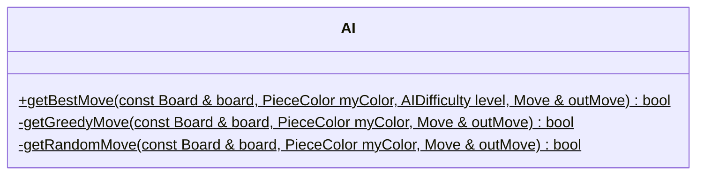

### AIController

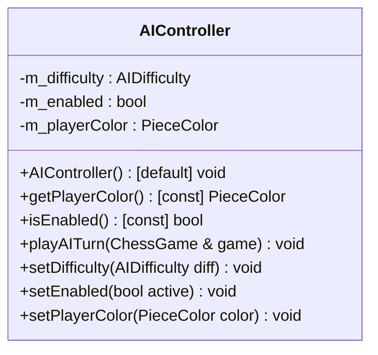

### Board

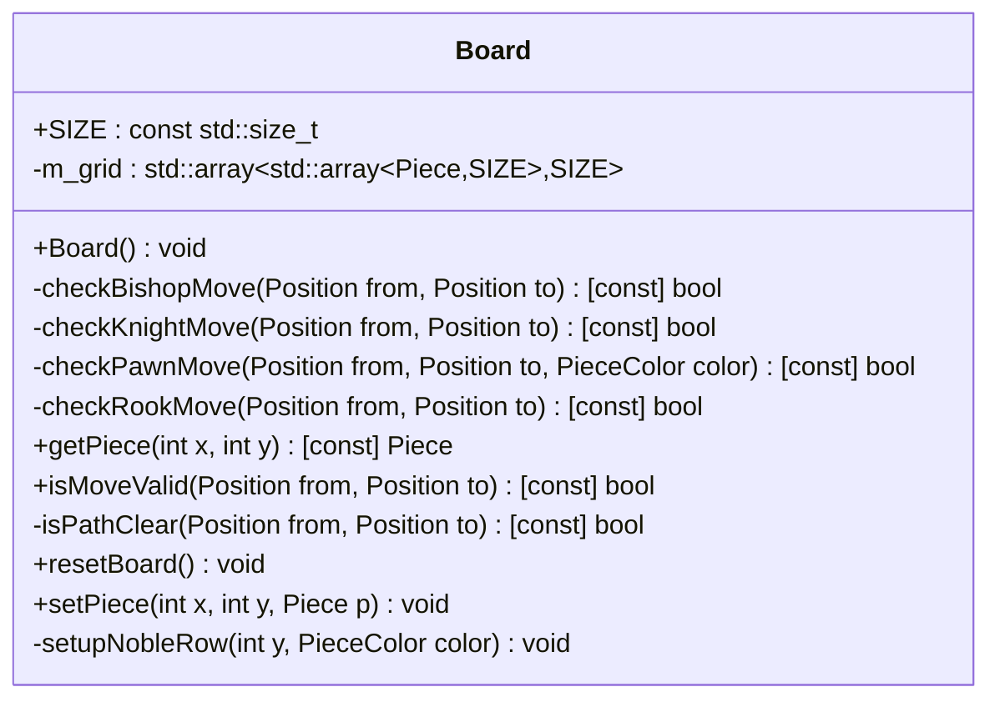

### ChessGame

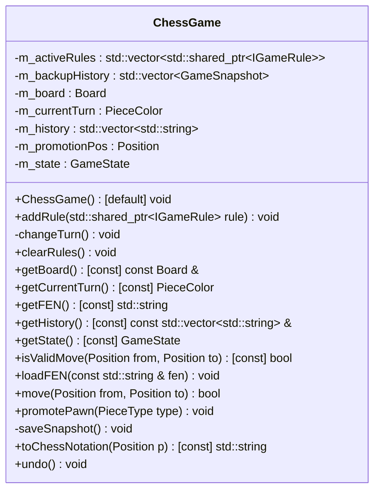

### ChessView

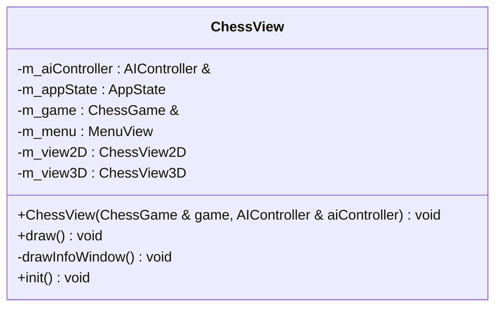

### ChessView2D

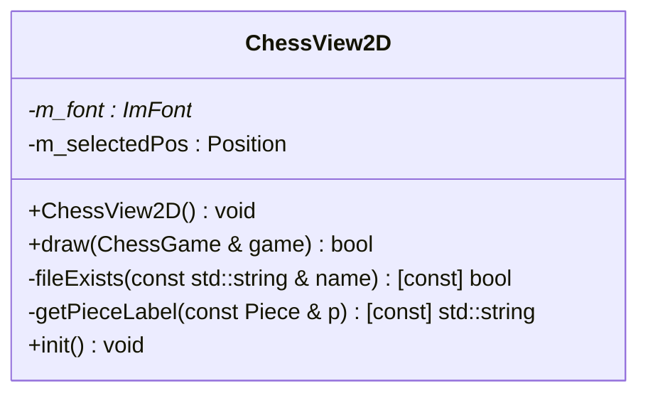

### ChessView3D

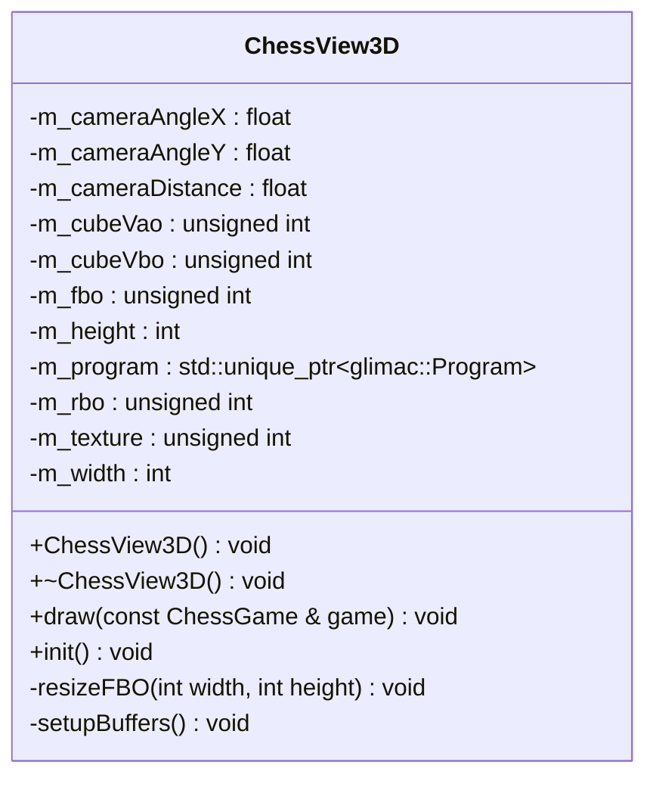

### GameSnapshot

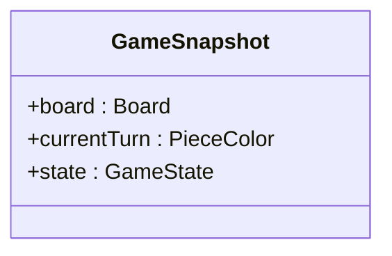

### IGameRule

### MenuView

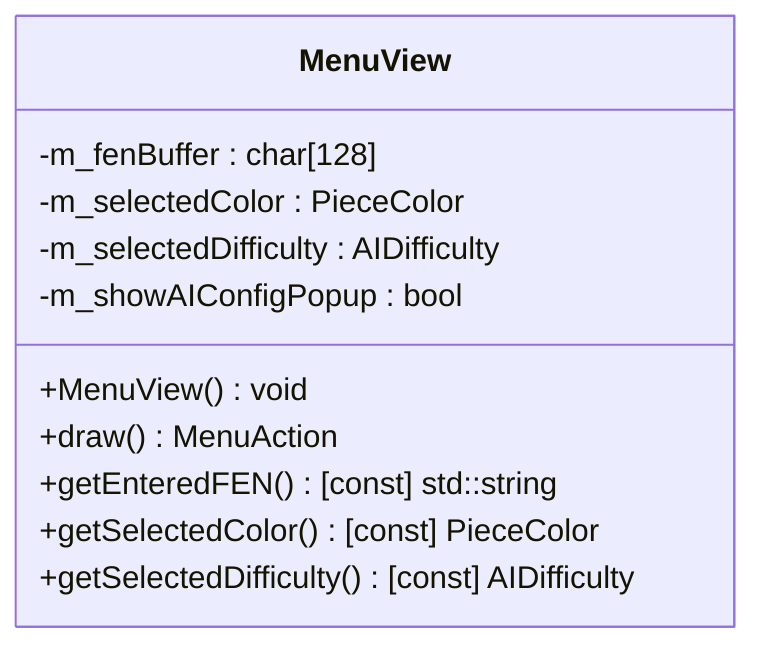

### Move

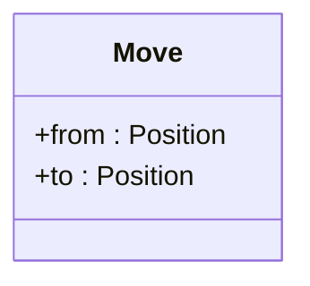

### Piece

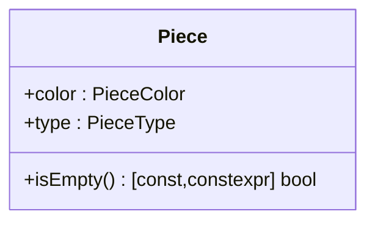

### Position

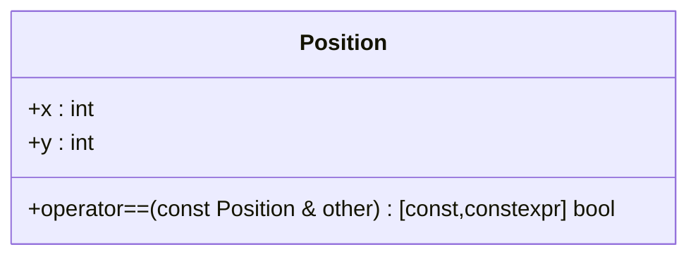

